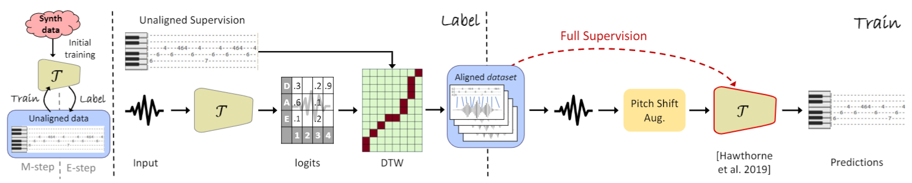

# Unaligned Supervision for Automatic Music Transcription in The Wild
Based on our ICML 2022 paper ["Unaligned Supervision for Automatic Music Transcription in The Wild"](https://proceedings.mlr.press/v162/maman22a.html).



We provide here [code](unaligned-supervision-master) for training a transcriber with unaligned supervision. Required data is pairs of real performances and corresponding MIDI performances, which can be unaligned with the audio and from unrelated performers. This kind of data is very easy to obtain. Training can also be done on a small dataset or even a single performance, to obtain aligned labels, which can later be used to train a transcriber on a large-scale dataset. In particular, you can use this code to create your own version of [MusicNetEM](musicnet_em.zip), which are our improved labels for the [MusicNet dataset](https://arxiv.org/abs/1611.09827) (the original dataset can be found [here](https://www.kaggle.com/imsparsh/musicnet-dataset)). We also provide here example transcriptions done by our system of famous pieces and songs, together with quantitative results on various benchmarks. The code implementation is based on the [PyTorch implementation of Onsets and Frames](https://github.com/jongwook/onsets-and-frames). For qualitative examples of transcriptions visit our [website](https://benadar293.github.io/).

## Instructions
Make sure you have all the requirements. Use the script [make_pitch_shifted_copies.py](unaligned-supervision-master/make_pitch_shifted_copies.py) to create pitch shifted copies of the performances (they will be resampled to 16kHz). Use the script [make_parsed_tsv_from_midi.py](unaligned-supervision-master/make_parsed_tsv_from_midi.py) to create representations of the corresponding MIDI files as note lists in tsv format. The scripts will create pitch shifted copies and tsv files for the provided MusicNet samples, but of course you can modify the scripts for new performances.

After running [make_pitch_shifted_copies.py](unaligned-supervision-master/make_pitch_shifted_copies.py) and [make_parsed_tsv_from_midi.py](unaligned-supervision-master/make_parsed_tsv_from_midi.py), you can train with [train.py](unaligned-supervision-master/train.py).

## Data formatting
The code assumes that each training group (corresponding to a single performance) is in a separate folder, and the corresponding MIDI folder has the exact amount of files, with the same lexicographic order. The script make_pitch_shifted_copies.py creates 11 copies of the audio data in "NoteEM_audio" inside the project root. The script make_parsed_tsv_from_midi.py creates tsv files in "NoteEM_tsv" inside the project root. The tsv files do not include multiple copies for the pitch shifted copies becuase the training script shifts the labels when required.

## Pre-Trained Checkpoints
In order to train, you need some initial transcriber that was trained to detect pitch, e.g., one that was trained on synthetic data. You can find two such checkpoints here:

[model_64.pt](https://drive.google.com/file/d/1RW7Tvaq8jhhjQ3mm5crrBjiFZ7f4mlo9/view?usp=sharing)

[model_48.pt](https://drive.google.com/file/d/15QbAJWKkMu4lI4dbf7VYyyLbjq0dvL58/view?usp=sharing)


## MusicNetEM
In addition, we provide here our [improved labels](musicnet_em.zip) for the [MusicNet dataset](https://arxiv.org/abs/1611.09827) (the original dataset can be found [here](https://www.kaggle.com/imsparsh/musicnet-dataset)). The labels were generated automatically by our method. We refer to MusicNet recordings with our labels as MusicNetEM. We provide a baseline for training from scratch on MusicNetEM, including cross-dataset evaluation. The labels are in the form of MIDI files aligned with the audio, and include instrument information. Onset timing accuracy of the labels is 32ms, which is sufficient to train a transcriber. Onset timings in the original MusicNet labels are not accurate enough for this.

The labels were generated automatically by an EM process similar to the one described in our paper ["Unaligned Supervision for Automatic Music Transcription in The Wild"](https://link-url-here.org). We improved the alignment algorithm, and in order to get more accurate labels, we divided the datast into three groups, based on the ensembles: piano solo, strings, and wind. We performed the EM process on each group separately.

You can train from scratch the architecture from the [MAESTRO paper](https://arxiv.org/abs/1810.12247) on MusicNet recordings with our labels.

For note-with-instrument transcription, use N_KEYS * (N_INSTRUMENTS + 1) onset classes, one for each note/instrument combination, and additional N_KEYS for pitch indepenedent of instrument. 
We used 88 * 12 = 1056 classes. Training in this manner for 101K steps of batch size 8, without any augmentation, we've reached: 


| test set | note F1 | note-with-inst. F1 | frame F1 | note-with-offset F1 |
| --- | :-: | :-: | :-: | :-: |
| **MAPS** | 82.0| 82.0 |69.1 | 37.7 |
| **MAESTRO** | 85.0 | 85.0 |65.2 | 31.9 |
| **GuitarSet** | 72.8 | - | 68.4 | 30.7 |
| **MusicNetEM** | 91.4 | 88.1 | 82.5 | 71.4 |
| **MusicNetEM wind** | 88.5 | 79.9 | 83.1 | 65.0 |
| **MusicNetEM strings** | 89.1 | 85.5 | 82.6 | 77.7 |
| **MusicNetEM strings** * | 85.9 | 81.1 | 79.0 | 75.1 |

| test instrument | note-with-inst. F1 |
| --- | :-: |
| **Violin** | 87.3 |
| **Viola** | 61.1 |
| **Cello** | 79.9 |
|**Bassoon** | 78.0 |
|**Clarinet** | 86.8 |
| **Horn** | 75.0 |


To reproduce the results from the paper, the EM process, as described in the [paper](https://link-url-here.org), including synthetic data pre-training, pitch-shift augmentation, and loss masking, is required.

Links to performances excerpts of which we used for demonstration:

[Myung-Whun Chung & Orchestre Philharmonique de Radio France, Bizet Carmen Overture](https://www.youtube.com/watch?v=jL-Csf1pNCI&ab_channel=FranceMusique)

[Mozart, Eine Kleine Nachtmusik](https://www.youtube.com/watch?v=oy2zDJPIgwc&ab_channel=AllClassicalMusic)

[Julien Salemkour, Mozart Symphony NO. 40](https://www.youtube.com/watch?v=wqkXqpQMk2k&ab_channel=EuroArtsChannel)

[Trevor Pinnock, Bach Harpsichord Concerto No. 1](https://www.youtube.com/watch?v=R66fz9yxzAk&ab_channel=SoliDeoGloria8550)

[Frank Monster, Bach Inverntion No. 8](https://www.youtube.com/watch?v=whbFffxr2q4&ab_channel=NetherlandsBachSociety)

[John Williams & Boston Pops Orchestra, Indiana Jones Theme Song](https://www.youtube.com/watch?v=-bTpp8PQSog&ab_channel=Vyrium)

[Hungarian Symphony Orchestra, Brahms Hungarian Dance NO. 5](https://www.youtube.com/watch?v=Nzo3atXtm54&ab_channel=MelosKonzerte)

[Rossini Barber of Seville Overture](https://www.youtube.com/watch?v=OloXRhesab0&t=2s&ab_channel=ClassicalMusicOnly)

[Nino Gvetadze, Brahms Piano Concerto No. 2](https://www.youtube.com/watch?v=YzZy1is6ZRU&ab_channel=Levan)

[Arturo Benedetti Michelangeli, Carlo Maria Giulini, & Wiener Symphoniker, Beethoven Piano Concerto No. 5](https://www.youtube.com/watch?v=TahrEIVu4nQ&ab_channel=pianoconc2)

[United States Marine Band, John Philip Sousa's "The Stars and Stripes Forever"](https://www.youtube.com/watch?v=a-7XWhyvIpE&ab_channel=UnitedStatesMarineBand)

[Desireless, Voyage](https://www.youtube.com/watch?v=NlgmH5q9uNk&ab_channel=Desireless)

[Maddona, La Isla Bonita](https://www.youtube.com/watch?v=zpzdgmqIHOQ&ab_channel=Madonna)

[Toto, Africa](https://www.youtube.com/watch?v=FTQbiNvZqaY&ab_channel=TotoVEVO)

[ABBA, Gimme](https://www.youtube.com/watch?v=JWay7CDEyAI&ab_channel=CraigGagn%C3%A9)

[Dick Dale and the Del Tones, Misirlou (Pulp Fiction Soundtrack)](https://www.youtube.com/watch?v=1hLIXrlpRe8)

## Cite
If you use this work, please cite us:

```json
@inproceedings{DBLP:conf/icml/MamanB22,
  author    = {Ben Maman and
               Amit H. Bermano},
  editor    = {Kamalika Chaudhuri and
               Stefanie Jegelka and
               Le Song and
               Csaba Szepesv{\'{a}}ri and
               Gang Niu and
               Sivan Sabato},
  title     = {Unaligned Supervision for Automatic Music Transcription in The Wild},
  booktitle = {International Conference on Machine Learning, {ICML} 2022, 17-23 July
               2022, Baltimore, Maryland, {USA}},
  series    = {Proceedings of Machine Learning Research},
  volume    = {162},
  pages     = {14918--14934},
  publisher = {{PMLR}},
  year      = {2022},
  url       = {https://proceedings.mlr.press/v162/maman22a.html},
  timestamp = {Tue, 12 Jul 2022 17:36:52 +0200},
  biburl    = {https://dblp.org/rec/conf/icml/MamanB22.bib},
  bibsource = {dblp computer science bibliography, https://dblp.org}
}
```


